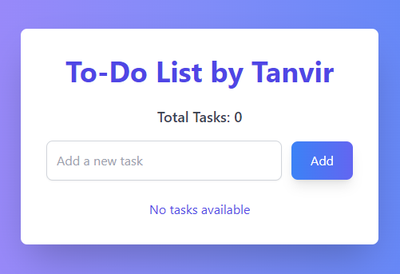

# To-Do List App

This is a simple and modern To-Do List application built with React and styled using Tailwind CSS. It allows users to add, mark as complete, and delete tasks. The app also includes local storage support, so tasks are saved across sessions.

## Features

- Add a new task with a task description.
- Mark tasks as completed.
- Delete tasks.
- Show the date and time when the task was added.
- Display the total number of tasks.
- Data is saved in the browser's local storage.
- Responsive and modern design.

## Preview



## Installation

Follow these steps to get the project up and running locally:

### 1. Clone the repository:

```bash
git clone https://github.com/your-username/todo-app.git
```

### 2. Navigate into the project directory:

```bash
cd todo-app
```

### 3. Install the required dependencies:

```bash
npm install
```

### 4. Start the development server:

```bash
npm start
```

The app will now be running at `http://localhost:3000`.

## Build for Production

To create a production-ready build, run:

```bash
npm run build
```

This will generate an optimized build of the app in the `build` folder.

## Folder Structure

The project folder structure is as follows:

```bash
.
├── public
│   ├── index.html
│   └── ...
├── src
│   ├── components
│   │   ├── TodoForm.js
│   │   ├── TodoList.js
│   │   ├── TodoItem.js
│   └── App.js
├── package.json
├── tailwind.config.js
└── ...
```

## License

This project is licensed under the MIT License.
